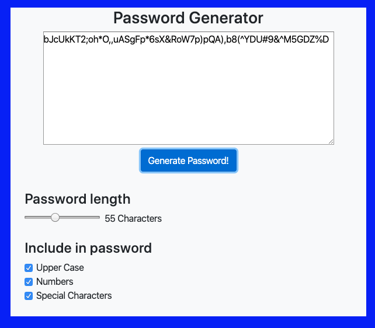

# Homework_3
Password Generator Homework

3/13/20
The following site creates random passwords that range from 8-128 characters and can include lower case characters, upper case caracters, special characters, and numbers. The interactive form below the text box allows you to select the length and complexity of your password. An image of the page is shown below. 

Going forward I would like to create a checking function that will test the password to make sure it includes all the required characters. This will get rid of the off chance that the randomly generated password will miss those values in the password array. This is a small problem and is unlikely with longer passwords but is still a good next step. 

